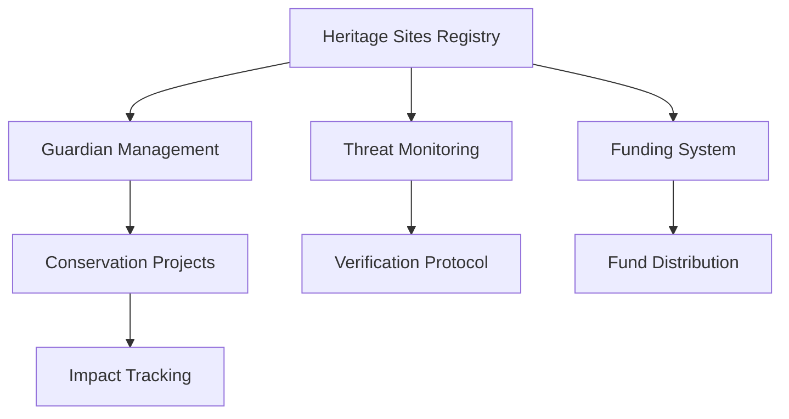

# 🌍 Cultural Heritage Protection on Blockchain

> Safeguarding humanity's treasures through decentralized technology

A revolutionary smart contract ecosystem built on Stacks blockchain that empowers global communities to protect, monitor, and preserve cultural heritage sites through transparent, decentralized governance.


## 🎯 Vision

Cultural heritage sites face unprecedented threats from climate change, urbanization, conflict, and neglect. This project harnesses blockchain technology to create an immutable, transparent, and community-driven system for heritage protection that transcends borders and empowers every individual to become a guardian of our shared human legacy.

## ⚡ Key Capabilities

### 🏛️ **Heritage Registry**
Decentralized registration system for cultural sites with immutable records, detailed metadata, and provenance tracking.

### 🔍 **Threat Intelligence**
Community-powered early warning system with threat classification, verification protocols, and rapid response mechanisms.

### 💎 **Conservation Funding**
Transparent crowdfunding platform with milestone-based releases, impact tracking, and donor recognition.

### 👥 **Guardian Network**
Decentralized stewardship model with role-based access controls and accountability mechanisms.

### 📈 **Impact Analytics**
Real-time dashboards tracking preservation efforts, funding flows, and community engagement metrics.

## 🚀 Getting Started

### System Requirements
```bash
# Required tools
Clarinet >= 2.0
Node.js >= 16.0
Stacks Wallet
```

### Quick Setup
```bash
# 1. Clone repository
git clone <repository-url>
cd Blockchain-based-Cultural-Heritage-Protection

# 2. Install dependencies
npm install

# 3. Validate contract
clarinet check

# 4. Run test suite
npm test

# 5. Deploy locally
clarinet integrate
```

## 🛠️ Core Functions

### Register Heritage Site
```clarity
(register-heritage-site 
  "Angkor Wat" 
  "Siem Reap, Cambodia" 
  "12th-century temple complex" 
  u5000  ; cultural value score
  u10000000) ; funding goal (microSTX)
```

### Report Threat
```clarity
(report-threat 
  u1 ; site ID
  "Climate damage" 
  u3 ; threat level (1-4)
  "Rising sea levels affecting foundation")
```

### Fund Conservation
```clarity
(fund-heritage-site u1 u500000) ; site ID, amount in microSTX
```

### Launch Conservation Project
```clarity
(create-conservation-project 
  u1 
  "Emergency Restoration" 
  "Structural repairs to prevent collapse" 
  u2000000 ; budget
  u1000000) ; deadline (block height)
```

## 🏗️ Architecture Overview



### Data Models

**Heritage Site**
- Unique identifier & metadata
- Geographic coordinates
- Cultural significance score
- Current status & threat level
- Funding goals & achievements
- Guardian assignments

**Threat Report**
- Site reference & reporter identity
- Threat classification & severity
- Evidence & verification status
- Resolution tracking

**Conservation Project**
- Project scope & timeline
- Budget allocation & spending
- Milestone tracking
- Completion certificates

## 🔐 Security Features

- **Multi-signature governance** for critical operations
- **Time-locked fund releases** with milestone verification
- **Reputation-based guardian selection**
- **Immutable audit trails** for all transactions
- **Slashing mechanisms** for malicious actors

## 📊 Status Codes

| Code | Status | Description |
|------|--------|-------------|
| 1 | ACTIVE | Site operational & secure |
| 2 | THREATENED | Facing identified risks |
| 3 | PROTECTED | Under conservation |
| 4 | DAMAGED | Requires urgent attention |

| Level | Threat | Response Time |
|-------|--------|---------------|
| 1 | LOW | 30 days |
| 2 | MEDIUM | 7 days |
| 3 | HIGH | 24 hours |
| 4 | CRITICAL | Immediate |

## 🧪 Testing Strategy

```bash
# Unit tests
npm run test:unit

# Integration tests
npm run test:integration

# Security audit
npm run audit:security

# Gas optimization
npm run test:performance
```

**Test Coverage:**
- ✅ Site registration & management
- ✅ Guardian role assignments
- ✅ Threat reporting workflow
- ✅ Funding mechanisms
- ✅ Conservation project lifecycle
- ✅ Access control validation
- ✅ Error handling

## 🌐 Deployment

### Mainnet Deployment
```bash
# Production deployment
clarinet deploy --network=mainnet

# Verify deployment
clarinet call get-total-funding --network=mainnet
```

### Testnet Deployment
```bash
# Testnet deployment
clarinet deploy --network=testnet

# Run integration tests
npm run test:testnet
```


**🌍 Heritage Experts**
- Site documentation
- Threat assessment protocols
- Conservation best practices


## 🏆 Milestones

- [x] **Phase 1**: Core contract development
- [x] **Phase 2**: Testing & security audit
- [ ] **Phase 3**: Frontend application
- [ ] **Phase 4**: Mobile app
- [ ] **Phase 5**: IoT sensor integration
- [ ] **Phase 6**: AI threat detection


## 📈 Impact Metrics

- **Sites Protected**: Track registered heritage sites
- **Threats Mitigated**: Monitor successful interventions
- **Funds Raised**: Measure community support
- **Projects Completed**: Document conservation success
- **Global Reach**: Expand geographic coverage


## 📄 License

MIT License - see [LICENSE](LICENSE) file for details.


---

**🌟 Together, we can preserve humanity's greatest treasures for future generations 🌟**

*"The heritage of the past is the seed that brings forth the harvest of the future" - Wendell Phillips*